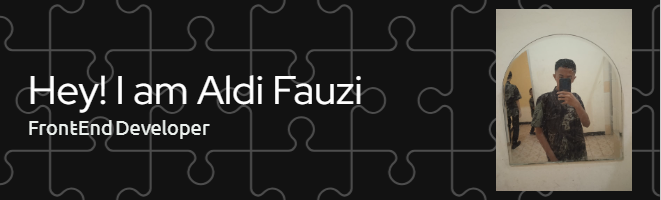

## Halo minna 👋

#### Nama saya Aldi Fauzi , Seorang anak yang berkeinginan tinggi untuk menjadi "Front-End Developer".

##### Di bawah ini adalah Projek yang pernah saya kerjakan,Skill yang saya miliki dan juga beberapa hal yang saya ketahui tentang Front-End Development.

###  🧑 Personal Branding saya
- 🎮 Saya sangat suka bermain games.
- 🎵 Saya sangat suka mendengarkan music sambil melakukan pekerjaan.
- 🚶‍♂️ Saya sangat suka jalan-jalan.
- 📖 Saya sangat suka membaca komik.
 

### 🎯 Tujuan Saya
- Menjadi Front-End Developer yang handal
- Membuat portofolio proyek nyata
- Berkontribusi di proyek open source
 
### 💻 Skill yang saya miliki

### 💻 Proyek yang pernah saya kerjakan
- 📚 Membuat Website CRUD Absensi menggunakan Framewrok Laravel.
- 🎮 Membuat Game Tebak Objek menggunakan platform pengembangan game bernama PhaserJS.
- 💬 Ask me about ...
- 📫 How to reach me: ...
- 😄 Pronouns: ...
- ⚡ Fun fact: ...
